```python
import pandas as pd
import numpy as np
import seaborn as sns
import matplotlib.pyplot as plt
!pip install bioinfokit
```

    Collecting bioinfokit
      Downloading bioinfokit-2.0.8.tar.gz (84 kB)
         |████████████████████████████████| 84 kB 1.6 MB/s             
    [?25h  Preparing metadata (setup.py) ... [?25l- done
    [?25hRequirement already satisfied: pandas in /opt/conda/lib/python3.7/site-packages (from bioinfokit) (1.3.4)
    Requirement already satisfied: numpy in /opt/conda/lib/python3.7/site-packages (from bioinfokit) (1.19.5)
    Requirement already satisfied: matplotlib in /opt/conda/lib/python3.7/site-packages (from bioinfokit) (3.5.1)
    Requirement already satisfied: scipy in /opt/conda/lib/python3.7/site-packages (from bioinfokit) (1.7.3)
    Requirement already satisfied: scikit-learn in /opt/conda/lib/python3.7/site-packages (from bioinfokit) (0.23.2)
    Requirement already satisfied: seaborn in /opt/conda/lib/python3.7/site-packages (from bioinfokit) (0.11.2)
    Requirement already satisfied: matplotlib-venn in /opt/conda/lib/python3.7/site-packages (from bioinfokit) (0.11.6)
    Requirement already satisfied: tabulate in /opt/conda/lib/python3.7/site-packages (from bioinfokit) (0.8.9)
    Requirement already satisfied: statsmodels in /opt/conda/lib/python3.7/site-packages (from bioinfokit) (0.12.2)
    Requirement already satisfied: textwrap3 in /opt/conda/lib/python3.7/site-packages (from bioinfokit) (0.9.2)
    Collecting adjustText
      Downloading adjustText-0.7.3.tar.gz (7.5 kB)
      Preparing metadata (setup.py) ... [?25l- done
    [?25hRequirement already satisfied: cycler>=0.10 in /opt/conda/lib/python3.7/site-packages (from matplotlib->bioinfokit) (0.11.0)
    Requirement already satisfied: packaging>=20.0 in /opt/conda/lib/python3.7/site-packages (from matplotlib->bioinfokit) (21.3)
    Requirement already satisfied: kiwisolver>=1.0.1 in /opt/conda/lib/python3.7/site-packages (from matplotlib->bioinfokit) (1.3.2)
    Requirement already satisfied: fonttools>=4.22.0 in /opt/conda/lib/python3.7/site-packages (from matplotlib->bioinfokit) (4.28.2)
    Requirement already satisfied: pillow>=6.2.0 in /opt/conda/lib/python3.7/site-packages (from matplotlib->bioinfokit) (8.2.0)
    Requirement already satisfied: python-dateutil>=2.7 in /opt/conda/lib/python3.7/site-packages (from matplotlib->bioinfokit) (2.8.0)
    Requirement already satisfied: pyparsing>=2.2.1 in /opt/conda/lib/python3.7/site-packages (from matplotlib->bioinfokit) (3.0.6)
    Requirement already satisfied: pytz>=2017.3 in /opt/conda/lib/python3.7/site-packages (from pandas->bioinfokit) (2021.3)
    Requirement already satisfied: threadpoolctl>=2.0.0 in /opt/conda/lib/python3.7/site-packages (from scikit-learn->bioinfokit) (3.0.0)
    Requirement already satisfied: joblib>=0.11 in /opt/conda/lib/python3.7/site-packages (from scikit-learn->bioinfokit) (1.1.0)
    Requirement already satisfied: patsy>=0.5 in /opt/conda/lib/python3.7/site-packages (from statsmodels->bioinfokit) (0.5.2)
    Requirement already satisfied: six in /opt/conda/lib/python3.7/site-packages (from patsy>=0.5->statsmodels->bioinfokit) (1.16.0)
    Building wheels for collected packages: bioinfokit, adjustText
      Building wheel for bioinfokit (setup.py) ... [?25l- \ done
    [?25h  Created wheel for bioinfokit: filename=bioinfokit-2.0.8-py3-none-any.whl size=56749 sha256=a1dfee75705909eae29de9fbc6669285ff68030a0f2850c38d451aee3c2d1a0d
      Stored in directory: /root/.cache/pip/wheels/0d/b0/a4/2be59655e33c889f2197d43e99ed077f05a6559e24ce28e21a
      Building wheel for adjustText (setup.py) ... [?25l- \ done
    [?25h  Created wheel for adjustText: filename=adjustText-0.7.3-py3-none-any.whl size=7094 sha256=34aabc4cf25f117d2b2e619ec1d158ef8188b2d96b1ee92ec9893d3cf64a14f5
      Stored in directory: /root/.cache/pip/wheels/2f/98/32/afbf902d8f040fadfdf0a44357e4ab750afe165d873bf5893d
    Successfully built bioinfokit adjustText
    Installing collected packages: adjustText, bioinfokit
    Successfully installed adjustText-0.7.3 bioinfokit-2.0.8
    WARNING: Running pip as the 'root' user can result in broken permissions and conflicting behaviour with the system package manager. It is recommended to use a virtual environment instead: https://pip.pypa.io/warnings/venv


```python
#Loading the dataset
df = pd.read_csv("../input/mcdonalds/mcdonalds.csv")
df.shape
df.head()
df.dtypes
# 11 variable(cols) has yes or no values.

# checking for null data --> No null data
df.info()
df.isnull().sum()
```

    <class 'pandas.core.frame.DataFrame'>
    RangeIndex: 1453 entries, 0 to 1452
    Data columns (total 15 columns):
     #   Column          Non-Null Count  Dtype 
    ---  ------          --------------  ----- 
     0   yummy           1453 non-null   object
     1   convenient      1453 non-null   object
     2   spicy           1453 non-null   object
     3   fattening       1453 non-null   object
     4   greasy          1453 non-null   object
     5   fast            1453 non-null   object
     6   cheap           1453 non-null   object
     7   tasty           1453 non-null   object
     8   expensive       1453 non-null   object
     9   healthy         1453 non-null   object
     10  disgusting      1453 non-null   object
     11  Like            1453 non-null   object
     12  Age             1453 non-null   int64 
     13  VisitFrequency  1453 non-null   object
     14  Gender          1453 non-null   object
    dtypes: int64(1), object(14)
    memory usage: 170.4+ KB
    


    yummy             0
    convenient        0
    spicy             0
    fattening         0
    greasy            0
    fast              0
    cheap             0
    tasty             0
    expensive         0
    healthy           0
    disgusting        0
    Like              0
    Age               0
    VisitFrequency    0
    Gender            0
    dtype: int64


```python
#Checking for the count of below variables
df['Gender'].value_counts()
df['VisitFrequency'].value_counts()
df['Like'].value_counts()
```


    +3              229
    +2              187
    0               169
    +4              160
    +1              152
    I hate it!-5    152
    I love it!+5    143
    -3               73
    -4               71
    -2               59
    -1               58
    Name: Like, dtype: int64


***EXPLORING DATA***


```python

#EXPLORING DATA

#Customer segmentation - based on socio-demographs (Age & Gender)

#Gender
labels = ['Female', 'Male']
size = df['Gender'].value_counts()
colors = ['pink', 'cyan']
explode = [0, 0.1]
plt.rcParams['figure.figsize'] = (7, 7)
plt.pie(size, colors = colors, explode = explode, labels = labels, shadow = True, autopct = '%.2f%%')
plt.title('Gender', fontsize = 20)
plt.axis('off')
plt.legend()
plt.show()
#we infer that there are more female customers than male.

#Age
plt.rcParams['figure.figsize'] = (25, 8)
f = sns.countplot(x=df['Age'],palette = 'hsv')
f.bar_label(f.containers[0])
plt.title('Age distribution of customers')
plt.show()
# Mcdonalds recieve more customers of age between 50-60 and 35-40.

```


    
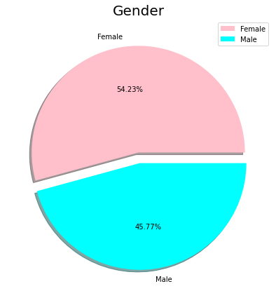
    


    
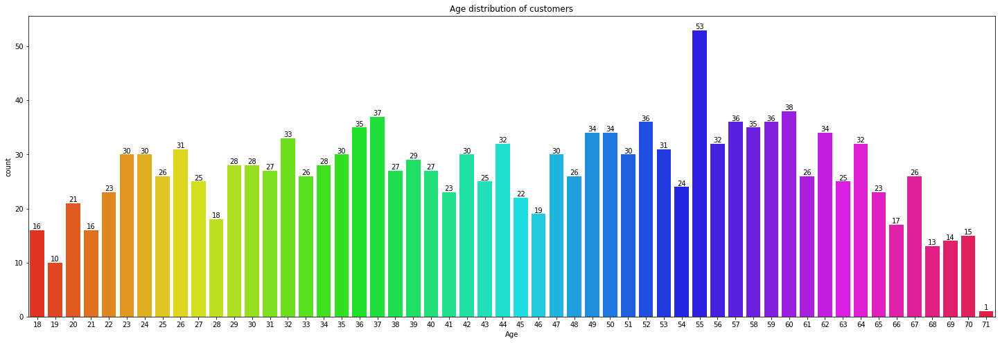
    


```python
#Customer segmentation - based on pyschographic segmentation

#For convinence renaming the category
df['Like']= df['Like'].replace({'I hate it!-5': '-5','I love it!+5':'+5'})
#Like 
sns.catplot(x="Like", y="Age",data=df, 
            orient="v", height=5, aspect=2, palette="Set2",kind="swarm")
plt.title('Likelyness of McDonald w.r.t Age')
plt.show()


```


    
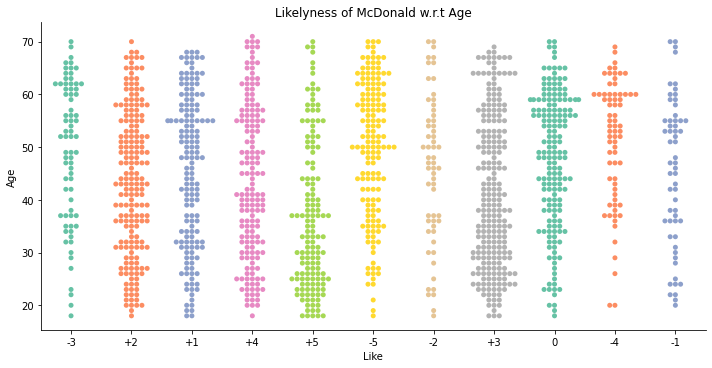
    


```python
#Label encoding for categorical - Converting 11 cols with yes/no

from sklearn.preprocessing import LabelEncoder
def labelling(x):
    df[x] = LabelEncoder().fit_transform(df[x])
    return df

cat = ['yummy', 'convenient', 'spicy', 'fattening', 'greasy', 'fast', 'cheap',
       'tasty', 'expensive', 'healthy', 'disgusting']

for i in cat:
    labelling(i)
df
```


<div>
<style scoped>
    .dataframe tbody tr th:only-of-type {
        vertical-align: middle;
    }

    .dataframe tbody tr th {
        vertical-align: top;
    }

    .dataframe thead th {
        text-align: right;
    }
</style>
<table border="1" class="dataframe">
  <thead>
    <tr style="text-align: right;">
      <th></th>
      <th>yummy</th>
      <th>convenient</th>
      <th>spicy</th>
      <th>fattening</th>
      <th>greasy</th>
      <th>fast</th>
      <th>cheap</th>
      <th>tasty</th>
      <th>expensive</th>
      <th>healthy</th>
      <th>disgusting</th>
      <th>Like</th>
      <th>Age</th>
      <th>VisitFrequency</th>
      <th>Gender</th>
    </tr>
  </thead>
  <tbody>
    <tr>
      <th>0</th>
      <td>0</td>
      <td>1</td>
      <td>0</td>
      <td>1</td>
      <td>0</td>
      <td>1</td>
      <td>1</td>
      <td>0</td>
      <td>1</td>
      <td>0</td>
      <td>0</td>
      <td>-3</td>
      <td>61</td>
      <td>Every three months</td>
      <td>Female</td>
    </tr>
    <tr>
      <th>1</th>
      <td>1</td>
      <td>1</td>
      <td>0</td>
      <td>1</td>
      <td>1</td>
      <td>1</td>
      <td>1</td>
      <td>1</td>
      <td>1</td>
      <td>0</td>
      <td>0</td>
      <td>+2</td>
      <td>51</td>
      <td>Every three months</td>
      <td>Female</td>
    </tr>
    <tr>
      <th>2</th>
      <td>0</td>
      <td>1</td>
      <td>1</td>
      <td>1</td>
      <td>1</td>
      <td>1</td>
      <td>0</td>
      <td>1</td>
      <td>1</td>
      <td>1</td>
      <td>0</td>
      <td>+1</td>
      <td>62</td>
      <td>Every three months</td>
      <td>Female</td>
    </tr>
    <tr>
      <th>3</th>
      <td>1</td>
      <td>1</td>
      <td>0</td>
      <td>1</td>
      <td>1</td>
      <td>1</td>
      <td>1</td>
      <td>1</td>
      <td>0</td>
      <td>0</td>
      <td>1</td>
      <td>+4</td>
      <td>69</td>
      <td>Once a week</td>
      <td>Female</td>
    </tr>
    <tr>
      <th>4</th>
      <td>0</td>
      <td>1</td>
      <td>0</td>
      <td>1</td>
      <td>1</td>
      <td>1</td>
      <td>1</td>
      <td>0</td>
      <td>0</td>
      <td>1</td>
      <td>0</td>
      <td>+2</td>
      <td>49</td>
      <td>Once a month</td>
      <td>Male</td>
    </tr>
    <tr>
      <th>...</th>
      <td>...</td>
      <td>...</td>
      <td>...</td>
      <td>...</td>
      <td>...</td>
      <td>...</td>
      <td>...</td>
      <td>...</td>
      <td>...</td>
      <td>...</td>
      <td>...</td>
      <td>...</td>
      <td>...</td>
      <td>...</td>
      <td>...</td>
    </tr>
    <tr>
      <th>1448</th>
      <td>0</td>
      <td>1</td>
      <td>0</td>
      <td>1</td>
      <td>1</td>
      <td>0</td>
      <td>0</td>
      <td>0</td>
      <td>1</td>
      <td>0</td>
      <td>1</td>
      <td>-5</td>
      <td>47</td>
      <td>Once a year</td>
      <td>Male</td>
    </tr>
    <tr>
      <th>1449</th>
      <td>1</td>
      <td>1</td>
      <td>0</td>
      <td>1</td>
      <td>0</td>
      <td>0</td>
      <td>1</td>
      <td>1</td>
      <td>0</td>
      <td>1</td>
      <td>0</td>
      <td>+2</td>
      <td>36</td>
      <td>Once a week</td>
      <td>Female</td>
    </tr>
    <tr>
      <th>1450</th>
      <td>1</td>
      <td>1</td>
      <td>0</td>
      <td>1</td>
      <td>0</td>
      <td>1</td>
      <td>0</td>
      <td>1</td>
      <td>1</td>
      <td>0</td>
      <td>0</td>
      <td>+3</td>
      <td>52</td>
      <td>Once a month</td>
      <td>Female</td>
    </tr>
    <tr>
      <th>1451</th>
      <td>1</td>
      <td>1</td>
      <td>0</td>
      <td>0</td>
      <td>0</td>
      <td>1</td>
      <td>1</td>
      <td>1</td>
      <td>0</td>
      <td>1</td>
      <td>0</td>
      <td>+4</td>
      <td>41</td>
      <td>Every three months</td>
      <td>Male</td>
    </tr>
    <tr>
      <th>1452</th>
      <td>0</td>
      <td>1</td>
      <td>0</td>
      <td>1</td>
      <td>1</td>
      <td>0</td>
      <td>0</td>
      <td>0</td>
      <td>1</td>
      <td>0</td>
      <td>1</td>
      <td>-3</td>
      <td>30</td>
      <td>Every three months</td>
      <td>Male</td>
    </tr>
  </tbody>
</table>
<p>1453 rows × 15 columns</p>
</div>


```python
#Histogram of the each attributes
plt.rcParams['figure.figsize'] = (12,14)
df.hist()
plt.show()
```


    
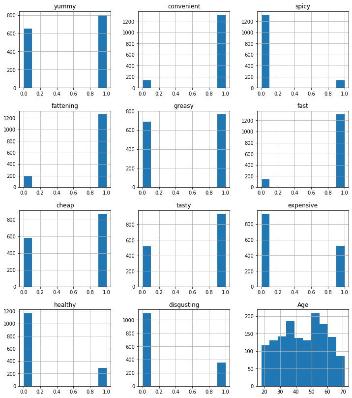
    


```python
#Considering only first 11 attributes
df_eleven = df.loc[:,cat]
df_eleven
```


<div>
<style scoped>
    .dataframe tbody tr th:only-of-type {
        vertical-align: middle;
    }

    .dataframe tbody tr th {
        vertical-align: top;
    }

    .dataframe thead th {
        text-align: right;
    }
</style>
<table border="1" class="dataframe">
  <thead>
    <tr style="text-align: right;">
      <th></th>
      <th>yummy</th>
      <th>convenient</th>
      <th>spicy</th>
      <th>fattening</th>
      <th>greasy</th>
      <th>fast</th>
      <th>cheap</th>
      <th>tasty</th>
      <th>expensive</th>
      <th>healthy</th>
      <th>disgusting</th>
    </tr>
  </thead>
  <tbody>
    <tr>
      <th>0</th>
      <td>0</td>
      <td>1</td>
      <td>0</td>
      <td>1</td>
      <td>0</td>
      <td>1</td>
      <td>1</td>
      <td>0</td>
      <td>1</td>
      <td>0</td>
      <td>0</td>
    </tr>
    <tr>
      <th>1</th>
      <td>1</td>
      <td>1</td>
      <td>0</td>
      <td>1</td>
      <td>1</td>
      <td>1</td>
      <td>1</td>
      <td>1</td>
      <td>1</td>
      <td>0</td>
      <td>0</td>
    </tr>
    <tr>
      <th>2</th>
      <td>0</td>
      <td>1</td>
      <td>1</td>
      <td>1</td>
      <td>1</td>
      <td>1</td>
      <td>0</td>
      <td>1</td>
      <td>1</td>
      <td>1</td>
      <td>0</td>
    </tr>
    <tr>
      <th>3</th>
      <td>1</td>
      <td>1</td>
      <td>0</td>
      <td>1</td>
      <td>1</td>
      <td>1</td>
      <td>1</td>
      <td>1</td>
      <td>0</td>
      <td>0</td>
      <td>1</td>
    </tr>
    <tr>
      <th>4</th>
      <td>0</td>
      <td>1</td>
      <td>0</td>
      <td>1</td>
      <td>1</td>
      <td>1</td>
      <td>1</td>
      <td>0</td>
      <td>0</td>
      <td>1</td>
      <td>0</td>
    </tr>
    <tr>
      <th>...</th>
      <td>...</td>
      <td>...</td>
      <td>...</td>
      <td>...</td>
      <td>...</td>
      <td>...</td>
      <td>...</td>
      <td>...</td>
      <td>...</td>
      <td>...</td>
      <td>...</td>
    </tr>
    <tr>
      <th>1448</th>
      <td>0</td>
      <td>1</td>
      <td>0</td>
      <td>1</td>
      <td>1</td>
      <td>0</td>
      <td>0</td>
      <td>0</td>
      <td>1</td>
      <td>0</td>
      <td>1</td>
    </tr>
    <tr>
      <th>1449</th>
      <td>1</td>
      <td>1</td>
      <td>0</td>
      <td>1</td>
      <td>0</td>
      <td>0</td>
      <td>1</td>
      <td>1</td>
      <td>0</td>
      <td>1</td>
      <td>0</td>
    </tr>
    <tr>
      <th>1450</th>
      <td>1</td>
      <td>1</td>
      <td>0</td>
      <td>1</td>
      <td>0</td>
      <td>1</td>
      <td>0</td>
      <td>1</td>
      <td>1</td>
      <td>0</td>
      <td>0</td>
    </tr>
    <tr>
      <th>1451</th>
      <td>1</td>
      <td>1</td>
      <td>0</td>
      <td>0</td>
      <td>0</td>
      <td>1</td>
      <td>1</td>
      <td>1</td>
      <td>0</td>
      <td>1</td>
      <td>0</td>
    </tr>
    <tr>
      <th>1452</th>
      <td>0</td>
      <td>1</td>
      <td>0</td>
      <td>1</td>
      <td>1</td>
      <td>0</td>
      <td>0</td>
      <td>0</td>
      <td>1</td>
      <td>0</td>
      <td>1</td>
    </tr>
  </tbody>
</table>
<p>1453 rows × 11 columns</p>
</div>


```python
#Considering only the 11 cols and converting it into array
x = df.loc[:,cat].values
x
```


    array([[0, 1, 0, ..., 1, 0, 0],
           [1, 1, 0, ..., 1, 0, 0],
           [0, 1, 1, ..., 1, 1, 0],
           ...,
           [1, 1, 0, ..., 1, 0, 0],
           [1, 1, 0, ..., 0, 1, 0],
           [0, 1, 0, ..., 1, 0, 1]])


```python
#Principal component analysis

from sklearn.decomposition import PCA
from sklearn import preprocessing

pca_data = preprocessing.scale(x)

pca = PCA(n_components=11)
pc = pca.fit_transform(x)
names = ['pc1','pc2','pc3','pc4','pc5','pc6','pc7','pc8','pc9','pc10','pc11']
pf = pd.DataFrame(data = pc, columns = names)
pf

```


<div>
<style scoped>
    .dataframe tbody tr th:only-of-type {
        vertical-align: middle;
    }

    .dataframe tbody tr th {
        vertical-align: top;
    }

    .dataframe thead th {
        text-align: right;
    }
</style>
<table border="1" class="dataframe">
  <thead>
    <tr style="text-align: right;">
      <th></th>
      <th>pc1</th>
      <th>pc2</th>
      <th>pc3</th>
      <th>pc4</th>
      <th>pc5</th>
      <th>pc6</th>
      <th>pc7</th>
      <th>pc8</th>
      <th>pc9</th>
      <th>pc10</th>
      <th>pc11</th>
    </tr>
  </thead>
  <tbody>
    <tr>
      <th>0</th>
      <td>0.425367</td>
      <td>-0.219079</td>
      <td>0.663255</td>
      <td>-0.401300</td>
      <td>0.201705</td>
      <td>-0.389767</td>
      <td>-0.211982</td>
      <td>0.163235</td>
      <td>0.181007</td>
      <td>0.515706</td>
      <td>-0.567074</td>
    </tr>
    <tr>
      <th>1</th>
      <td>-0.218638</td>
      <td>0.388190</td>
      <td>-0.730827</td>
      <td>-0.094724</td>
      <td>0.044669</td>
      <td>-0.086596</td>
      <td>-0.095877</td>
      <td>-0.034756</td>
      <td>0.111476</td>
      <td>0.493313</td>
      <td>-0.500440</td>
    </tr>
    <tr>
      <th>2</th>
      <td>0.375415</td>
      <td>0.730435</td>
      <td>-0.122040</td>
      <td>0.692262</td>
      <td>0.839643</td>
      <td>-0.687406</td>
      <td>0.583112</td>
      <td>0.364379</td>
      <td>-0.322288</td>
      <td>0.061759</td>
      <td>0.242741</td>
    </tr>
    <tr>
      <th>3</th>
      <td>-0.172926</td>
      <td>-0.352752</td>
      <td>-0.843795</td>
      <td>0.206998</td>
      <td>-0.681415</td>
      <td>-0.036133</td>
      <td>-0.054284</td>
      <td>-0.231477</td>
      <td>-0.028003</td>
      <td>-0.250678</td>
      <td>-0.051034</td>
    </tr>
    <tr>
      <th>4</th>
      <td>0.187057</td>
      <td>-0.807610</td>
      <td>0.028537</td>
      <td>0.548332</td>
      <td>0.854074</td>
      <td>-0.097305</td>
      <td>-0.457043</td>
      <td>0.171758</td>
      <td>-0.074409</td>
      <td>0.031897</td>
      <td>0.082245</td>
    </tr>
    <tr>
      <th>...</th>
      <td>...</td>
      <td>...</td>
      <td>...</td>
      <td>...</td>
      <td>...</td>
      <td>...</td>
      <td>...</td>
      <td>...</td>
      <td>...</td>
      <td>...</td>
      <td>...</td>
    </tr>
    <tr>
      <th>1448</th>
      <td>1.550242</td>
      <td>0.275031</td>
      <td>-0.013737</td>
      <td>0.200604</td>
      <td>-0.145063</td>
      <td>0.306575</td>
      <td>-0.075308</td>
      <td>0.345552</td>
      <td>-0.136589</td>
      <td>-0.432798</td>
      <td>-0.456076</td>
    </tr>
    <tr>
      <th>1449</th>
      <td>-0.957339</td>
      <td>0.014308</td>
      <td>0.303843</td>
      <td>0.444350</td>
      <td>-0.133690</td>
      <td>0.381804</td>
      <td>-0.326432</td>
      <td>0.878047</td>
      <td>-0.304441</td>
      <td>-0.247443</td>
      <td>-0.193671</td>
    </tr>
    <tr>
      <th>1450</th>
      <td>-0.185894</td>
      <td>1.062662</td>
      <td>0.220857</td>
      <td>-0.467643</td>
      <td>-0.187757</td>
      <td>-0.192703</td>
      <td>-0.091597</td>
      <td>-0.036576</td>
      <td>0.038255</td>
      <td>0.056518</td>
      <td>-0.012800</td>
    </tr>
    <tr>
      <th>1451</th>
      <td>-1.182064</td>
      <td>-0.038570</td>
      <td>0.561561</td>
      <td>0.701126</td>
      <td>0.047645</td>
      <td>0.193687</td>
      <td>-0.027335</td>
      <td>-0.339374</td>
      <td>0.022267</td>
      <td>-0.002573</td>
      <td>-0.105316</td>
    </tr>
    <tr>
      <th>1452</th>
      <td>1.550242</td>
      <td>0.275031</td>
      <td>-0.013737</td>
      <td>0.200604</td>
      <td>-0.145063</td>
      <td>0.306575</td>
      <td>-0.075308</td>
      <td>0.345552</td>
      <td>-0.136589</td>
      <td>-0.432798</td>
      <td>-0.456076</td>
    </tr>
  </tbody>
</table>
<p>1453 rows × 11 columns</p>
</div>


```python
#Proportion of Variance (from PC1 to PC11)
pca.explained_variance_ratio_
```


    array([0.29944723, 0.19279721, 0.13304535, 0.08309578, 0.05948052,
           0.05029956, 0.0438491 , 0.03954779, 0.0367609 , 0.03235329,
           0.02932326])


```python
np.cumsum(pca.explained_variance_ratio_)
```


    array([0.29944723, 0.49224445, 0.6252898 , 0.70838558, 0.7678661 ,
           0.81816566, 0.86201476, 0.90156255, 0.93832345, 0.97067674,
           1.        ])


```python
# correlation coefficient between original variables and the component

loadings = pca.components_
num_pc = pca.n_features_
pc_list = ["PC"+str(i) for i in list(range(1, num_pc+1))]
loadings_df = pd.DataFrame.from_dict(dict(zip(pc_list, loadings)))
loadings_df['variable'] = df_eleven.columns.values
loadings_df = loadings_df.set_index('variable')
loadings_df
```


<div>
<style scoped>
    .dataframe tbody tr th:only-of-type {
        vertical-align: middle;
    }

    .dataframe tbody tr th {
        vertical-align: top;
    }

    .dataframe thead th {
        text-align: right;
    }
</style>
<table border="1" class="dataframe">
  <thead>
    <tr style="text-align: right;">
      <th></th>
      <th>PC1</th>
      <th>PC2</th>
      <th>PC3</th>
      <th>PC4</th>
      <th>PC5</th>
      <th>PC6</th>
      <th>PC7</th>
      <th>PC8</th>
      <th>PC9</th>
      <th>PC10</th>
      <th>PC11</th>
    </tr>
    <tr>
      <th>variable</th>
      <th></th>
      <th></th>
      <th></th>
      <th></th>
      <th></th>
      <th></th>
      <th></th>
      <th></th>
      <th></th>
      <th></th>
      <th></th>
    </tr>
  </thead>
  <tbody>
    <tr>
      <th>yummy</th>
      <td>-0.476933</td>
      <td>0.363790</td>
      <td>-0.304444</td>
      <td>0.055162</td>
      <td>-0.307535</td>
      <td>0.170738</td>
      <td>-0.280519</td>
      <td>0.013041</td>
      <td>0.572403</td>
      <td>-0.110284</td>
      <td>0.045439</td>
    </tr>
    <tr>
      <th>convenient</th>
      <td>-0.155332</td>
      <td>0.016414</td>
      <td>-0.062515</td>
      <td>-0.142425</td>
      <td>0.277608</td>
      <td>-0.347830</td>
      <td>-0.059738</td>
      <td>-0.113079</td>
      <td>-0.018465</td>
      <td>-0.665818</td>
      <td>-0.541616</td>
    </tr>
    <tr>
      <th>spicy</th>
      <td>-0.006356</td>
      <td>0.018809</td>
      <td>-0.037019</td>
      <td>0.197619</td>
      <td>0.070620</td>
      <td>-0.355087</td>
      <td>0.707637</td>
      <td>0.375934</td>
      <td>0.400280</td>
      <td>-0.075634</td>
      <td>0.141730</td>
    </tr>
    <tr>
      <th>fattening</th>
      <td>0.116232</td>
      <td>-0.034094</td>
      <td>-0.322359</td>
      <td>-0.354139</td>
      <td>-0.073405</td>
      <td>-0.406515</td>
      <td>-0.385943</td>
      <td>0.589622</td>
      <td>-0.160512</td>
      <td>-0.005338</td>
      <td>0.250910</td>
    </tr>
    <tr>
      <th>greasy</th>
      <td>0.304443</td>
      <td>-0.063839</td>
      <td>-0.802373</td>
      <td>0.253960</td>
      <td>0.361399</td>
      <td>0.209347</td>
      <td>0.036170</td>
      <td>-0.138241</td>
      <td>-0.002847</td>
      <td>0.008707</td>
      <td>0.001642</td>
    </tr>
    <tr>
      <th>fast</th>
      <td>-0.108493</td>
      <td>-0.086972</td>
      <td>-0.064642</td>
      <td>-0.097363</td>
      <td>0.107930</td>
      <td>-0.594632</td>
      <td>-0.086846</td>
      <td>-0.627799</td>
      <td>0.166197</td>
      <td>0.239532</td>
      <td>0.339265</td>
    </tr>
    <tr>
      <th>cheap</th>
      <td>-0.337186</td>
      <td>-0.610633</td>
      <td>-0.149310</td>
      <td>0.118958</td>
      <td>-0.128973</td>
      <td>-0.103241</td>
      <td>-0.040449</td>
      <td>0.140060</td>
      <td>0.076069</td>
      <td>0.428087</td>
      <td>-0.489283</td>
    </tr>
    <tr>
      <th>tasty</th>
      <td>-0.471514</td>
      <td>0.307318</td>
      <td>-0.287265</td>
      <td>-0.002547</td>
      <td>-0.210899</td>
      <td>-0.076914</td>
      <td>0.360453</td>
      <td>-0.072792</td>
      <td>-0.639086</td>
      <td>0.079184</td>
      <td>0.019552</td>
    </tr>
    <tr>
      <th>expensive</th>
      <td>0.329042</td>
      <td>0.601286</td>
      <td>0.024397</td>
      <td>0.067816</td>
      <td>-0.003125</td>
      <td>-0.261342</td>
      <td>-0.068385</td>
      <td>0.029539</td>
      <td>0.066996</td>
      <td>0.454399</td>
      <td>-0.490069</td>
    </tr>
    <tr>
      <th>healthy</th>
      <td>-0.213711</td>
      <td>0.076593</td>
      <td>0.192051</td>
      <td>0.763488</td>
      <td>0.287846</td>
      <td>-0.178226</td>
      <td>-0.349616</td>
      <td>0.176303</td>
      <td>-0.185572</td>
      <td>-0.038117</td>
      <td>0.157608</td>
    </tr>
    <tr>
      <th>disgusting</th>
      <td>0.374753</td>
      <td>-0.139656</td>
      <td>-0.088571</td>
      <td>0.369539</td>
      <td>-0.729209</td>
      <td>-0.210878</td>
      <td>-0.026792</td>
      <td>-0.167181</td>
      <td>-0.072483</td>
      <td>-0.289592</td>
      <td>-0.040662</td>
    </tr>
  </tbody>
</table>
</div>


```python
#Correlation matrix plot for loadings 
plt.rcParams['figure.figsize'] = (20,15)
ax = sns.heatmap(loadings_df, annot=True, cmap='Spectral')
plt.show()
```


    
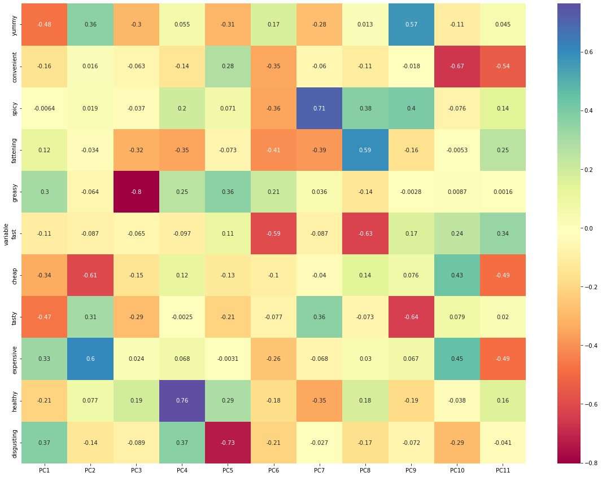
    


```python
#Scree plot (Elbow test)- PCA
from bioinfokit.visuz import cluster
cluster.screeplot(obj=[pc_list, pca.explained_variance_ratio_],show=True,dim=(10,5))
```


    
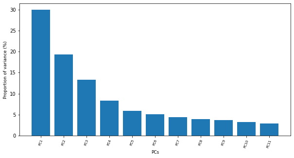
    


```python
# get PC scores
pca_scores = PCA().fit_transform(x)

# get 2D biplot
cluster.biplot(cscore=pca_scores, loadings=loadings, labels=df.columns.values, var1=round(pca.explained_variance_ratio_[0]*100, 2),
    var2=round(pca.explained_variance_ratio_[1]*100, 2),show=True,dim=(10,5))
```


    
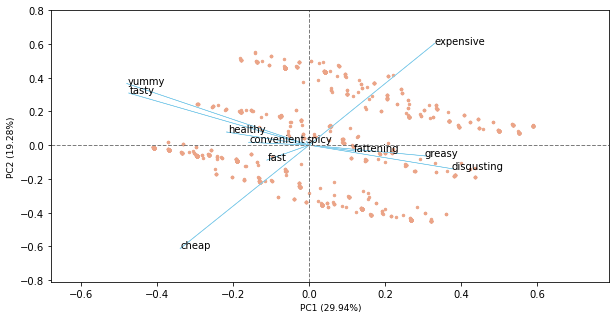
    


**EXTRACTING SEGMENTS**


```python
#Extracting segments

#Using k-means clustering analysis
from sklearn.cluster import KMeans
from yellowbrick.cluster import KElbowVisualizer
model = KMeans()
visualizer = KElbowVisualizer(model, k=(1,12)).fit(df_eleven)
visualizer.show()
```


    
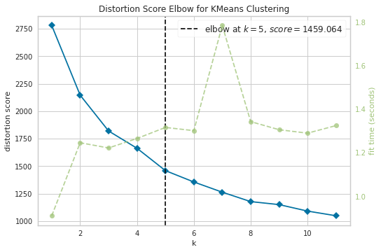
    


    <AxesSubplot:title={'center':'Distortion Score Elbow for KMeans Clustering'}, xlabel='k', ylabel='distortion score'>


```python
#K-means clustering 

kmeans = KMeans(n_clusters=4, init='k-means++', random_state=0).fit(df_eleven)
df['cluster_num'] = kmeans.labels_ #adding to df
print (kmeans.labels_) #Label assigned for each data point
print (kmeans.inertia_) #gives within-cluster sum of squares. 
print(kmeans.n_iter_) #number of iterations that k-means algorithm runs to get a minimum within-cluster sum of squares
print(kmeans.cluster_centers_) #Location of the centroids on each cluster. 
```

    [3 0 0 ... 0 1 2]
    1603.5029251924634
    9
    [[0.87619048 0.96825397 0.13650794 0.90793651 0.60952381 0.85714286
      0.11111111 0.93015873 0.91428571 0.20952381 0.10793651]
     [0.88793103 0.98103448 0.0862069  0.79482759 0.32931034 0.96034483
      0.92241379 0.97586207 0.01724138 0.32068966 0.04310345]
     [0.0173913  0.64782609 0.07826087 0.90869565 0.70434783 0.73043478
      0.07391304 0.09565217 0.95217391 0.06521739 0.7       ]
     [0.02439024 0.90243902 0.07621951 0.92682927 0.67073171 0.95426829
      0.86280488 0.16768293 0.00914634 0.06707317 0.4054878 ]]
    


```python
#To see each cluster size
from collections import Counter
Counter(kmeans.labels_)
```


    Counter({3: 328, 0: 315, 1: 580, 2: 230})


```python
#Visulazing clusters
sns.scatterplot(data=pf, x="pc1", y="pc2", hue=kmeans.labels_)
plt.scatter(kmeans.cluster_centers_[:,0], kmeans.cluster_centers_[:,1], 
            marker="X", c="r", s=80, label="centroids")
plt.legend()
plt.show()
```


    
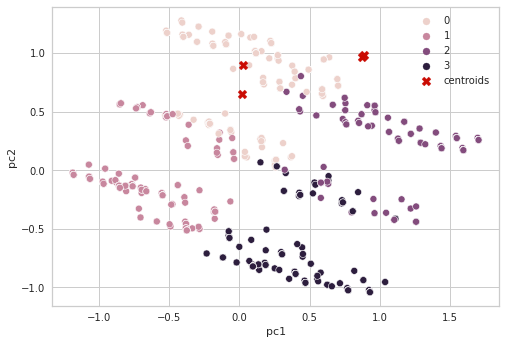
    


**DESCRIBING SEGMENTS**


```python
#DESCRIBING SEGMENTS

from statsmodels.graphics.mosaicplot import mosaic
from itertools import product

crosstab =pd.crosstab(df['cluster_num'],df['Like'])
#Reordering cols
crosstab = crosstab[['-5','-4','-3','-2','-1','0','+1','+2','+3','+4','+5']]
crosstab 
```


<div>
<style scoped>
    .dataframe tbody tr th:only-of-type {
        vertical-align: middle;
    }

    .dataframe tbody tr th {
        vertical-align: top;
    }

    .dataframe thead th {
        text-align: right;
    }
</style>
<table border="1" class="dataframe">
  <thead>
    <tr style="text-align: right;">
      <th>Like</th>
      <th>-5</th>
      <th>-4</th>
      <th>-3</th>
      <th>-2</th>
      <th>-1</th>
      <th>0</th>
      <th>+1</th>
      <th>+2</th>
      <th>+3</th>
      <th>+4</th>
      <th>+5</th>
    </tr>
    <tr>
      <th>cluster_num</th>
      <th></th>
      <th></th>
      <th></th>
      <th></th>
      <th></th>
      <th></th>
      <th></th>
      <th></th>
      <th></th>
      <th></th>
      <th></th>
    </tr>
  </thead>
  <tbody>
    <tr>
      <th>0</th>
      <td>5</td>
      <td>3</td>
      <td>6</td>
      <td>6</td>
      <td>6</td>
      <td>33</td>
      <td>41</td>
      <td>58</td>
      <td>66</td>
      <td>47</td>
      <td>44</td>
    </tr>
    <tr>
      <th>1</th>
      <td>4</td>
      <td>4</td>
      <td>2</td>
      <td>6</td>
      <td>13</td>
      <td>43</td>
      <td>65</td>
      <td>90</td>
      <td>143</td>
      <td>111</td>
      <td>99</td>
    </tr>
    <tr>
      <th>2</th>
      <td>84</td>
      <td>28</td>
      <td>28</td>
      <td>16</td>
      <td>11</td>
      <td>35</td>
      <td>13</td>
      <td>6</td>
      <td>9</td>
      <td>0</td>
      <td>0</td>
    </tr>
    <tr>
      <th>3</th>
      <td>59</td>
      <td>36</td>
      <td>37</td>
      <td>31</td>
      <td>28</td>
      <td>58</td>
      <td>33</td>
      <td>33</td>
      <td>11</td>
      <td>2</td>
      <td>0</td>
    </tr>
  </tbody>
</table>
</div>


```python
#MOSAIC PLOT
plt.rcParams['figure.figsize'] = (7,5)
mosaic(crosstab.stack())
plt.show()
```


    
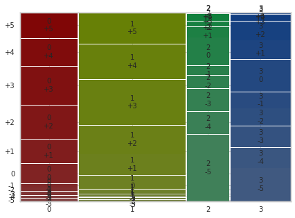
    


```python
#Mosaic plot gender vs segment
crosstab_gender =pd.crosstab(df['cluster_num'],df['Gender'])
crosstab_gender
```


<div>
<style scoped>
    .dataframe tbody tr th:only-of-type {
        vertical-align: middle;
    }

    .dataframe tbody tr th {
        vertical-align: top;
    }

    .dataframe thead th {
        text-align: right;
    }
</style>
<table border="1" class="dataframe">
  <thead>
    <tr style="text-align: right;">
      <th>Gender</th>
      <th>Female</th>
      <th>Male</th>
    </tr>
    <tr>
      <th>cluster_num</th>
      <th></th>
      <th></th>
    </tr>
  </thead>
  <tbody>
    <tr>
      <th>0</th>
      <td>151</td>
      <td>164</td>
    </tr>
    <tr>
      <th>1</th>
      <td>349</td>
      <td>231</td>
    </tr>
    <tr>
      <th>2</th>
      <td>96</td>
      <td>134</td>
    </tr>
    <tr>
      <th>3</th>
      <td>192</td>
      <td>136</td>
    </tr>
  </tbody>
</table>
</div>


```python
plt.rcParams['figure.figsize'] = (7,5)
mosaic(crosstab_gender.stack())
plt.show()
```


    
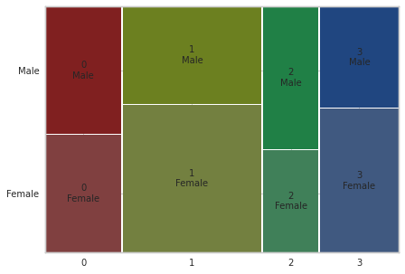
    


```python
#box plot for age

sns.boxplot(x="cluster_num", y="Age", data=df)

```


    <AxesSubplot:xlabel='cluster_num', ylabel='Age'>


    
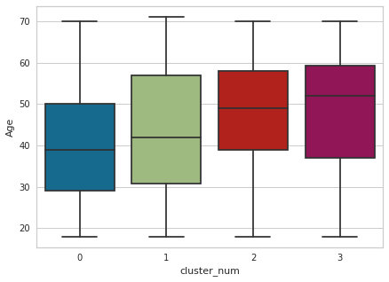
    


**Selecting target segment**


```python
#Calculating the mean
#Visit frequency
df['VisitFrequency'] = LabelEncoder().fit_transform(df['VisitFrequency'])
visit = df.groupby('cluster_num')['VisitFrequency'].mean()
visit = visit.to_frame().reset_index()
visit
```


<div>
<style scoped>
    .dataframe tbody tr th:only-of-type {
        vertical-align: middle;
    }

    .dataframe tbody tr th {
        vertical-align: top;
    }

    .dataframe thead th {
        text-align: right;
    }
</style>
<table border="1" class="dataframe">
  <thead>
    <tr style="text-align: right;">
      <th></th>
      <th>cluster_num</th>
      <th>VisitFrequency</th>
    </tr>
  </thead>
  <tbody>
    <tr>
      <th>0</th>
      <td>0</td>
      <td>2.542857</td>
    </tr>
    <tr>
      <th>1</th>
      <td>1</td>
      <td>2.584483</td>
    </tr>
    <tr>
      <th>2</th>
      <td>2</td>
      <td>2.686957</td>
    </tr>
    <tr>
      <th>3</th>
      <td>3</td>
      <td>2.789634</td>
    </tr>
  </tbody>
</table>
</div>


```python
#Like
df['Like'] = LabelEncoder().fit_transform(df['Like'])
Like = df.groupby('cluster_num')['Like'].mean()
Like = Like.to_frame().reset_index()
Like
```


<div>
<style scoped>
    .dataframe tbody tr th:only-of-type {
        vertical-align: middle;
    }

    .dataframe tbody tr th {
        vertical-align: top;
    }

    .dataframe thead th {
        text-align: right;
    }
</style>
<table border="1" class="dataframe">
  <thead>
    <tr style="text-align: right;">
      <th></th>
      <th>cluster_num</th>
      <th>Like</th>
    </tr>
  </thead>
  <tbody>
    <tr>
      <th>0</th>
      <td>0</td>
      <td>3.219048</td>
    </tr>
    <tr>
      <th>1</th>
      <td>1</td>
      <td>2.962069</td>
    </tr>
    <tr>
      <th>2</th>
      <td>2</td>
      <td>7.395652</td>
    </tr>
    <tr>
      <th>3</th>
      <td>3</td>
      <td>6.234756</td>
    </tr>
  </tbody>
</table>
</div>


```python
#Gender
df['Gender'] = LabelEncoder().fit_transform(df['Gender'])
Gender = df.groupby('cluster_num')['Gender'].mean()
Gender = Gender.to_frame().reset_index()
Gender
```


<div>
<style scoped>
    .dataframe tbody tr th:only-of-type {
        vertical-align: middle;
    }

    .dataframe tbody tr th {
        vertical-align: top;
    }

    .dataframe thead th {
        text-align: right;
    }
</style>
<table border="1" class="dataframe">
  <thead>
    <tr style="text-align: right;">
      <th></th>
      <th>cluster_num</th>
      <th>Gender</th>
    </tr>
  </thead>
  <tbody>
    <tr>
      <th>0</th>
      <td>0</td>
      <td>0.520635</td>
    </tr>
    <tr>
      <th>1</th>
      <td>1</td>
      <td>0.398276</td>
    </tr>
    <tr>
      <th>2</th>
      <td>2</td>
      <td>0.582609</td>
    </tr>
    <tr>
      <th>3</th>
      <td>3</td>
      <td>0.414634</td>
    </tr>
  </tbody>
</table>
</div>


```python
segment = Gender.merge(Like, on='cluster_num', how='left').merge(visit, on='cluster_num', how='left')
segment
```


<div>
<style scoped>
    .dataframe tbody tr th:only-of-type {
        vertical-align: middle;
    }

    .dataframe tbody tr th {
        vertical-align: top;
    }

    .dataframe thead th {
        text-align: right;
    }
</style>
<table border="1" class="dataframe">
  <thead>
    <tr style="text-align: right;">
      <th></th>
      <th>cluster_num</th>
      <th>Gender</th>
      <th>Like</th>
      <th>VisitFrequency</th>
    </tr>
  </thead>
  <tbody>
    <tr>
      <th>0</th>
      <td>0</td>
      <td>0.520635</td>
      <td>3.219048</td>
      <td>2.542857</td>
    </tr>
    <tr>
      <th>1</th>
      <td>1</td>
      <td>0.398276</td>
      <td>2.962069</td>
      <td>2.584483</td>
    </tr>
    <tr>
      <th>2</th>
      <td>2</td>
      <td>0.582609</td>
      <td>7.395652</td>
      <td>2.686957</td>
    </tr>
    <tr>
      <th>3</th>
      <td>3</td>
      <td>0.414634</td>
      <td>6.234756</td>
      <td>2.789634</td>
    </tr>
  </tbody>
</table>
</div>


```python
#Target segments

plt.figure(figsize = (9,4))
sns.scatterplot(x = "VisitFrequency", y = "Like",data=segment,s=400, color="r")
plt.title("Simple segment evaluation plot for the fast food data set",
          fontsize = 15) 
plt.xlabel("Visit", fontsize = 12) 
plt.ylabel("Like", fontsize = 12) 
plt.show()
```


    
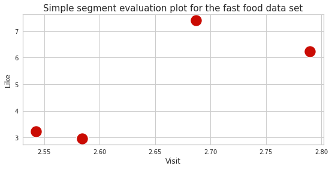
    


```python

```
